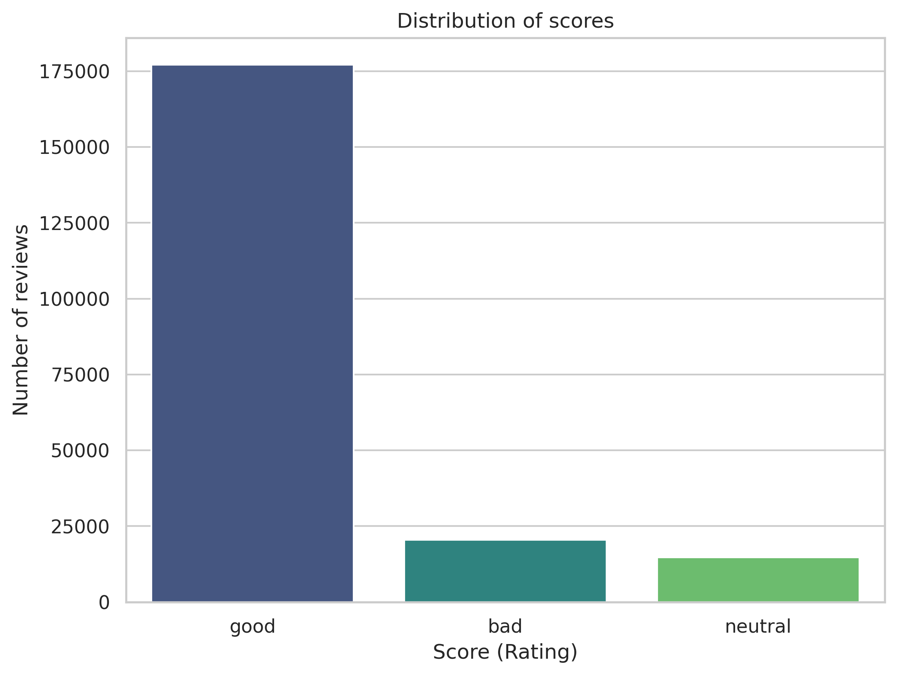

# Multi-Class Text Sentiment Analysis

This project compares classical machine learning, recurrent neural networks, and transformer-based models for three-class sentiment classification on Amazon Fine Food Reviews. Reviews with ratings of 1, 3, and 5 are mapped to **bad**, **neutral**, and **good**, respectively.

The experiments compare balanced and naturally imbalanced training data. DistilBERT produced the strongest recorded result, while LinearSVC provides a much lighter-weight alternative.



## Results

Macro F1 is the primary comparison metric because the validation and test sets are strongly imbalanced toward positive reviews.

### Held-Out Test Results

| Model | Training distribution | Accuracy | Macro F1 | Weighted F1 |
| --- | --- | ---: | ---: | ---: |
| LinearSVC | Balanced | 0.8640 | 0.7282 | 0.8800 |
| LinearSVC | Imbalanced | 0.9192 | 0.7542 | 0.9131 |
| Bidirectional LSTM | Balanced | 0.8936 | 0.7573 | 0.9046 |
| Bidirectional LSTM | Imbalanced | 0.9188 | 0.7655 | 0.9167 |
| MLP | Balanced | 0.8686 | 0.7338 | 0.8834 |
| MLP | Imbalanced | 0.9212 | 0.7635 | 0.9166 |
| DistilBERT | Balanced | 0.9218 | 0.8232 | 0.9293 |
| DistilBERT | Imbalanced | **0.9448** | **0.8368** | **0.9446** |

### Classical Model Validation Results

Logistic regression and the Naive Bayes models were compared on validation data. Only the selected LinearSVC models were subsequently evaluated on the held-out test set.

| Model | Training distribution | Accuracy | Macro F1 | Weighted F1 |
| --- | --- | ---: | ---: | ---: |
| Multinomial logistic regression | Balanced | 0.8406 | 0.6996 | 0.8621 |
| Multinomial logistic regression | Imbalanced | - | 0.7142 | - |
| Complement Naive Bayes | Balanced | 0.8602 | 0.7071 | 0.8736 |
| Complement Naive Bayes | Imbalanced | - | 0.6849 | - |
| Multinomial Naive Bayes | Balanced | 0.8446 | 0.6942 | 0.8637 |
| Multinomial Naive Bayes | Imbalanced | - | 0.6418 | - |

DistilBERT achieved class F1 scores of 0.8359 for bad, 0.6965 for neutral, and 0.9778 for good reviews. Neutral sentiment remained the hardest class for every model.

For the imbalanced classical-model comparison, the notebook's combined tuning table stores only macro F1. Accuracy and weighted F1 were not recorded there, so those cells are marked with a dash rather than estimated. All model families were trained with both balanced and imbalanced data; held-out test evaluation was limited to the selected classical model but was performed for both variants of the LSTM, MLP, and DistilBERT models.

## Project Workflow

Run the notebooks in numerical order:

1. [01_data_preparation.ipynb](01_data_preparation.ipynb) loads and explores the data, creates the splits, cleans and lemmatizes text, and generates TF-IDF features for balanced and imbalanced training sets.
2. [02_LinearSVC_MultinomialLogisticRegression_ComplementNB_MultinomialNB.ipynb](02_LinearSVC_MultinomialLogisticRegression_ComplementNB_MultinomialNB.ipynb) compares LinearSVC, multinomial logistic regression, Complement Naive Bayes, and Multinomial Naive Bayes.
3. [03_LSTM_model.ipynb](03_LSTM_model.ipynb) trains bidirectional LSTM variants with pretrained 300-dimensional GloVe embeddings.
4. [04_MLP.ipynb](04_MLP.ipynb) evaluates multilayer perceptrons with several hidden-layer configurations on TF-IDF features.
5. [05_DistilBERT.ipynb](05_DistilBERT.ipynb) fine-tunes `distilbert-base-uncased` with the Hugging Face Trainer API.

## Data Preparation

The project uses the [Amazon Fine Food Reviews dataset](https://www.kaggle.com/datasets/snap/amazon-fine-food-reviews). Place the downloaded file at `data/Reviews.csv`.

The preparation notebook:

- keeps ratings 1, 3, and 5 and maps them to bad, neutral, and good;
- limits reviews to at most 50 words;
- removes HTML, URLs, numbers, and non-letter characters;
- lowercases and performs POS-aware WordNet lemmatization;
- preserves sentiment-bearing stop words such as `not`, `no`, `never`, `nor`, and `but`;
- builds unigram and bigram TF-IDF features with a 10,000-feature limit.

The resulting split sizes are:

| Split | Bad | Neutral | Good | Total |
| --- | ---: | ---: | ---: | ---: |
| Balanced training | 13,333 | 13,333 | 13,333 | 39,999 |
| Imbalanced training | 3,869 | 2,778 | 33,353 | 40,000 |
| Validation | 484 | 347 | 4,169 | 5,000 |
| Test | 484 | 347 | 4,169 | 5,000 |

The LSTM notebook uses its own NLTK tokenization pipeline, a minimum token frequency of 10, and sequences of up to 50 tokens. The DistilBERT notebook performs light HTML, URL, and whitespace cleanup before tokenizing to a maximum length of 64.

## Libraries Used

| Area | Libraries | Purpose |
| --- | --- | --- |
| Data handling | Pandas, NumPy, SciPy | Loading data, numerical operations, and sparse matrices |
| Classical machine learning | scikit-learn, Joblib | TF-IDF features, model training, evaluation, and serialization |
| Natural language processing | NLTK | Tokenization, POS tagging, stop words, and lemmatization |
| Deep learning | PyTorch, TorchText | LSTM architecture, datasets, training, and vocabulary creation |
| Transformers | Transformers, Datasets, Accelerate | DistilBERT tokenization, fine-tuning, and evaluation |
| Visualization | Matplotlib, Seaborn | Class distributions, learning curves, and confusion matrices |

## Prerequisites

Before running the notebooks, ensure that you have:

- Python 3 with `pip` available;
- enough memory to hold the TF-IDF matrices and train the selected model;
- internet access for the initial NLTK resources and Hugging Face model downloads;
- `data/Reviews.csv`, downloaded from the [Amazon Fine Food Reviews dataset](https://www.kaggle.com/datasets/snap/amazon-fine-food-reviews);
- `glove.6B.300d.txt` in the project root when running the LSTM notebook.

A CUDA-capable GPU is optional. Classical models run well on CPU, but GPU acceleration is strongly recommended for LSTM and DistilBERT training.

PyTorch, TorchText, CUDA, and the installed GPU driver must use mutually compatible versions. Consult the [PyTorch installation selector](https://pytorch.org/get-started/locally/) when installing with CUDA support.

> **Note on versions:** [03_LSTM_model.ipynb](03_LSTM_model.ipynb) uses PyTorch 2.3 with TorchText, while [05_DistilBERT.ipynb](05_DistilBERT.ipynb) uses PyTorch 2.11 for full Transformers compatibility. If you run the notebooks separately, adjust the PyTorch version accordingly.

## Installation

Install the notebook dependencies with pip:

```bash
python -m pip install --upgrade pip
python -m pip install pandas numpy scipy scikit-learn matplotlib seaborn nltk joblib torch torchtext transformers datasets accelerate
python -m nltk.downloader wordnet omw-1.4 punkt averaged_perceptron_tagger
```

Download `glove.6B.300d.txt` from the [GloVe 6B dataset](https://www.kaggle.com/datasets/thanakomsn/glove6b300dtxt) if you plan to run the LSTM experiments.

## Generated Artifacts

| Path | Description |
| --- | --- |
| `prepared_data.pkl` | Balanced TF-IDF matrices, labels, and fitted vectorizer |
| `prepared_data_imbalanced.pkl` | Imbalanced TF-IDF matrices, labels, and fitted vectorizer |
| `sentiment_model.joblib` | Saved classical model artifact, including its fitted vectorizer |
| `models/best_LSTM_v*.pth` | Balanced LSTM PyTorch checkpoints |
| `models/best_LSTM_imb_v*.pth` | Imbalanced LSTM PyTorch checkpoints |
| `plots/` | Data distributions, training curves, and confusion matrices |
| `best_balanced_distilbert_model/` | Generated Hugging Face model directory after balanced training |
| `best_imbalanced_distilbert_model/` | Generated Hugging Face model directory after imbalanced training |

The two DistilBERT model directories are generated by the final notebook and are not included in the current repository. PyTorch `.pth` files contain model weights and require the matching architecture and vocabulary from the LSTM notebook.

## Model Notes

- **Multinomial logistic regression:** Implemented with scikit-learn's `LogisticRegression`. With three target classes and the `lbfgs` solver, it optimizes the multinomial loss rather than training a separate binary classifier for each class.
- **LinearSVC:** Best classical baseline, selected with `C=1.0`. It is fast to train and inexpensive to deploy.
- **LSTM:** A two-layer bidirectional LSTM with a hidden size of 128 and 300-dimensional GloVe embeddings. The experiments use Adam, `ReduceLROnPlateau`, and five training epochs.
- **MLP:** Tests hidden-layer shapes `(50,)`, `(100,)`, `(200,)`, and `(100, 50)`. A single 100-neuron hidden layer performed best.
- **DistilBERT:** Fine-tunes `distilbert-base-uncased` for three epochs with a learning rate of `2e-5` and validation F1-based model selection.

## Limitations

- The validation and test sets contain 83.4% good reviews, so accuracy and weighted F1 can hide poor minority-class performance.
- Three-star reviews are both scarce and linguistically ambiguous, making neutral sentiment the most difficult class.
- Filtering reviews to 50 words reduces training cost but can remove context needed for mixed or nuanced sentiment.
- The LSTM is sensitive to sarcasm, negation, product names, misspellings, and words missing from the GloVe vocabulary.
- Notebook results depend on random initialization, package versions, and available hardware, so reruns may differ slightly from the recorded metrics.

## Repository Structure

```text
.
|-- 01_data_preparation.ipynb
|-- 02_LinearSVC_MultinomialLogisticRegression_ComplementNB_MultinomialNB.ipynb
|-- 03_LSTM_model.ipynb
|-- 04_MLP.ipynb
|-- 05_DistilBERT.ipynb
|-- data/
|   `-- Reviews.csv
|-- models/
|-- plots/
|-- prepared_data.pkl
|-- prepared_data_imbalanced.pkl
`-- sentiment_model.joblib
```